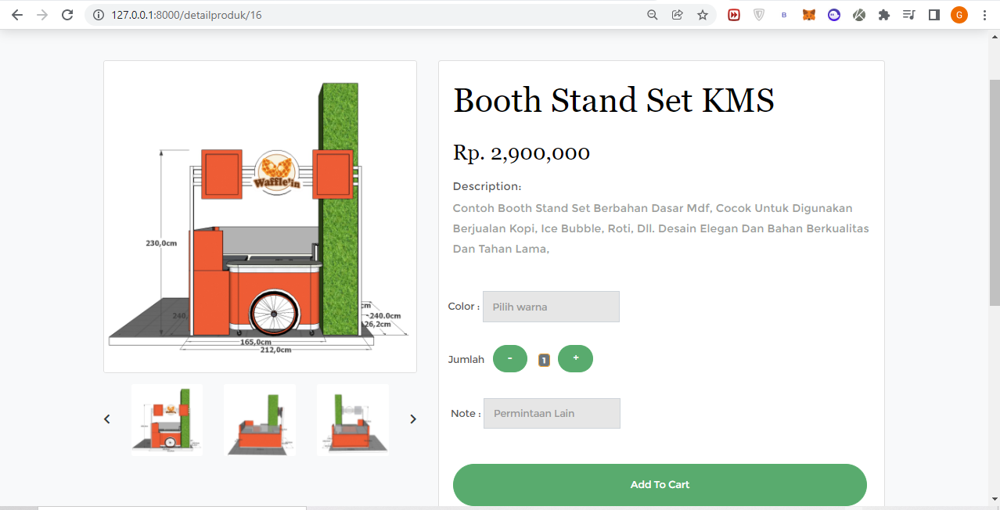

## E-Commerce Furniture - Laravel 8

Website E-commerce yang menyediakan informasi kepada customer secara detail tentang furniture berupa katalog  spesifikasi produk. Serta dapat melakukan proses transaksi pembelian secara online agar customer. Admin juga dapat berperan menambahkan produk, melihat daftar penjualan, memproses tranksasi, dan mengelola customer.

Manual Book :

https://github.com/agungadi/ECommerce-Furniture/files/8021140/Manual_Book.pdf
